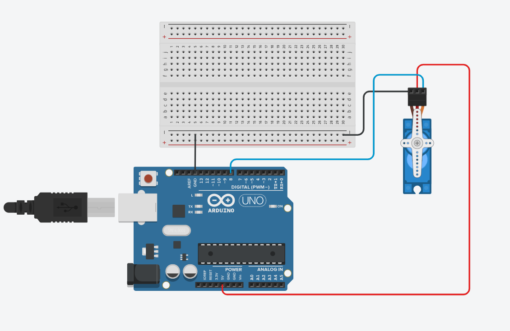
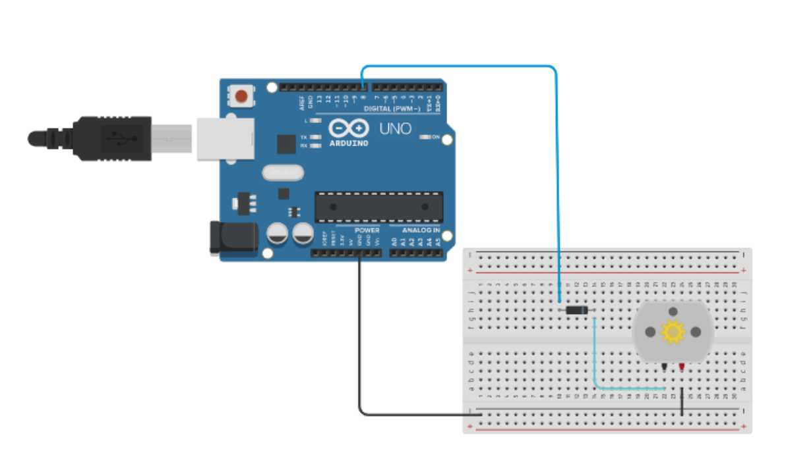

# Brushless-Motor

## Electrical&electronic power task🪛  

## How Stepper Motor Works:

 ### Circuit: 

   

Simulation▶️  

https://www.tinkercad.com/things/kdKF7DG9RU1 

## How Servo Motor Works:

### Circuit: 

  

Simulation▶️  
https://www.tinkercad.com/things/70LBO8a0X0V 

## How Brushless Motor Works:

### Circuit: 

  

Simulation▶️  

https://www.tinkercad.com/things/i5A084jjGUP

