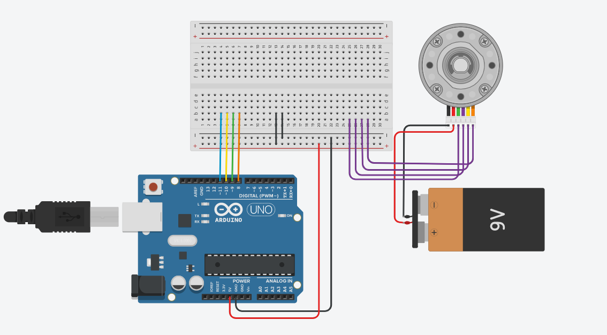

# Brushless-Motor

### Electrical&electronic power task🪛  

Here I will explain how Stepeer,Servo,Burshless motor works  
## Hardware Required🔋:  
**Arduino Board** 
**stepper motor** 
**power supply** 
**hook-up wires** 
**breadboard** 

## Circuit: 

   

Here to Simulation▶️  
https://www.tinkercad.com/things/kdKF7DG9RU1 
